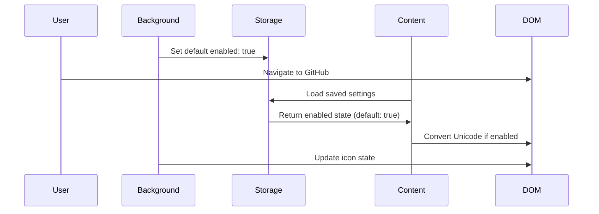
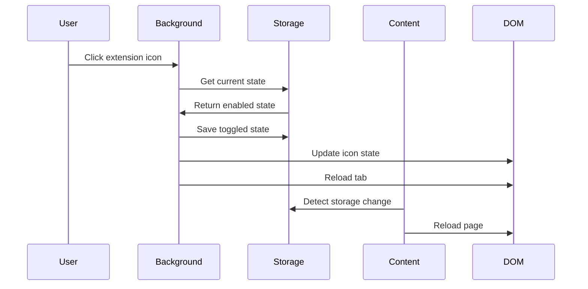
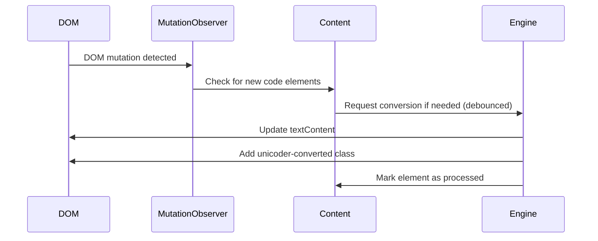

# Architecture Documentation

## プロジェクト概要

**GitHub Unicoder**は、GitHub上のUnicodeエスケープシーケンス（例：`\u30AD\u30E3\u30F3\u30BB\u30EB`）を読みやすい文字（例：`キャンセル`）に変換して表示するChrome拡張機能です。
Unityプロジェクトなどでは、マルチバイト文字列が自動的にUnicodeエスケープシーケンスに変換されるため、このままでは可読性が低く、適切なコードレビューが困難です。
本拡張機能は、これらを読みやすい元の文字列にリアルタイム変換して表示することで、開発効率を向上させます。

## システム全体図

```
┌─────────────────┐    ┌─────────────────┐    ┌─────────────────┐
│   GitHub Page   │    │  Content Script │    │ Background JS   │
│                 │◄──►│  (content.ts)   │◄──►│ (background.ts) │
│  DOM Elements   │    │                 │    │                 │
└─────────────────┘    └─────────────────┘    └─────────────────┘
         │                       │                       │
         │                       ▼                       ▼
         │              ┌─────────────────┐    ┌─────────────────┐
         │              │ Unicode Convert │    │ Chrome Storage  │
         │              │    Engine       │    │    API          │
         │              └─────────────────┘    └─────────────────┘
         │                       │                       │
         ▼                       ▼                       ▼
┌─────────────────┐    ┌─────────────────┐    ┌─────────────────┐
│  Visual Style   │    │  DOM Observer   │    │  Extension      │
│   (styles.css)  │    │   Mutation      │    │   Icon/Badge    │
└─────────────────┘    └─────────────────┘    └─────────────────┘
```

## プロジェクト構造

```
/github-unicoder/
├── .editorconfig               # エディタ設定
├── .gitignore                  # Git無視ファイル設定
├── .releaserc.json             # セマンティックリリース設定
├── .vscode/                    # VS Code設定
│   ├── extensions.json         # 推奨拡張機能
│   └── tasks.json              # ビルドタスク設定
├── manifest.json               # Chrome拡張機能マニフェスト (GitHub Unicoder)
├── package.json                # Node.js依存関係とスクリプト (作者: mob-sakai)
├── package-lock.json           # npm依存関係ロック
├── tsconfig.json               # TypeScript設定
├── LICENSE.md                  # MIT License
├── README.md                   # プロジェクト説明 (GitHub Unicoder)
├── ARCHITECTURE.md             # このアーキテクチャドキュメント
├── src/
│   ├── content.ts              # メインのコンテンツスクリプト
│   ├── background.ts           # バックグラウンドサービスワーカー  
│   ├── types.d.ts              # TypeScript型定義
│   └── static/
│       ├── styles.css          # CSS スタイル
│       └── icons/              # 拡張機能アイコン
│           ├── icon128.png     # 128x128 アイコン（通常状態）
│           └── icon128_d.png   # 128x128 アイコン（無効状態）
├── dist/                       # ビルド出力（Git無視）
├── node_modules/               # npm依存関係（Git無視）
└── .github/
    ├── copilot-instructions.md # GitHub Copilot 指示書
    ├── ISSUE_TEMPLATE/         # Issueテンプレート
    └── workflows/              # GitHub Actions ワークフロー
```

## アーキテクチャパターン

### 1. Chrome Extension MV3アーキテクチャ

本プロジェクトは**Chrome Extension Manifest V3**を採用し、以下の主要コンポーネントで構成されています：

- **Service Worker** (`background.ts`) - 拡張機能の中心的な制御とアイコン状態管理
- **Content Script** (`content.ts`) - Webページ上での実際の処理
- **Static Assets** - アイコン（通常/無効状態）、スタイル、マニフェスト

### 2. イベント駆動アーキテクチャ

```typescript
// イベントフロー
User Click → Background Script → Storage Update → Content Script → DOM Modification
```

## コアコンポーネント

### 1. Background Script (`src/background.ts`)

**責務**: 拡張機能の状態管理とユーザーインタラクション制御

```typescript
主要機能:
- 拡張機能アイコンクリック処理（直接トグル）
- Chrome Storage APIによる設定管理
- アイコン状態更新（通常/グレーアウト表示）
- タブリロード制御
- 初期設定（デフォルト有効）
```

**主要API**: 
- `chrome.action.onClicked` - アイコンクリック処理
- `chrome.storage.sync` - 設定の永続化
- `chrome.tabs.reload` - ページリロード
- `chrome.action.setIcon` - アイコン状態制御

### 2. Content Script (`src/content.ts`)

**責務**: GitHub DOM操作とUnicode変換処理

```typescript
主要クラス:
- UnicoderForGitHub: メインコントローラー
- UnicoderState: 状態管理インターフェース

interface UnicoderState {
  enabled: boolean;
  processedElements: Set<Element>;
}
```

**処理フロー**:
1. **初期化**: ストレージから設定読み込み（デフォルト有効）
2. **変換実行**: 対象要素の検出と変換
3. **監視開始**: MutationObserverによるDOM変更監視
4. **ストレージ監視**: 設定変更の検知とページリロード

### 3. Unicode変換エンジン

**アルゴリズム**:
```typescript
Patterns: 
  - /\\u([0-9a-fA-F]{4})/g  # Unicode (4桁): \uXXXX
  - /\\x([0-9a-fA-F]{2})/g  # Hexadecimal (2桁): \xXX
Process: 
  1. 正規表現でUnicodeエスケープとHexエスケープを検出
  2. 16進数文字列をcharCodeに変換（parseInt(hexCode, 16)）
  3. String.fromCharCode()で文字生成
  4. DOM要素のtextContentを直接更新
  5. unicoder-convertedクラス追加（視覚的フィードバック）
```

**対象セレクタ**:
- `.blob-code-inner` - GitHubコード行
- `.react-file-line` - React版GitHubファイル行
- `.diff-text-inner` - GitHub差分表示内のテキスト行

## データフロー

### 1. 初期化フロー



### 2. トグル操作フロー（直接クリック）



### 3. 動的変換フロー



## パフォーマンス最適化

### 1. 重複処理防止

```typescript
interface UnicoderState {
  processedElements: Set<Element>; // 処理済み要素の記録
}

// 既に処理済みの要素はスキップ
if (this.state.processedElements.has(element)) {
  return;
}
```

### 2. 選択的監視

```typescript
// 新しいコード要素が追加された場合のみ変換実行
const hasNewCodeElements = Array.from(mutation.addedNodes).some(node => {
  if (node.nodeType === Node.ELEMENT_NODE) {
    const element = node as Element;
    return element.querySelector('.blob-code-inner, .react-file-line');
  }
  return false;
});
```

### 3. デバウンス処理

```typescript
// DOM変更の連続発生時は100ms後に処理
setTimeout(() => {
  this.convertUnicodeEscapes();
}, 100);
```

## 視覚的フィードバック

### 1. CSSスタイリング

```css
.unicoder-converted {
  border-radius: 3px;
  border: 1px dashed #2e2e2e;
  margin-left: -1px;
}

/* GitHub差分表示対応 */
.blob-code-addition .unicoder-converted {
  border-color: #4CAF50;
}

.blob-code-deletion .unicoder-converted {
  border-color: #E57373;
}

/* ダークテーマ対応 */
[data-color-mode="dark"] .unicoder-converted {
  border-color: #DDDDDD;
}
```

### 2. アイコン状態表示

```typescript
// ON状態: 通常アイコン
chrome.action.setIcon({
  tabId: tabId,
  path: { "128": "icons/icon128.png" }
});

// OFF状態: グレーアウトアイコン
chrome.action.setIcon({
  tabId: tabId,
  path: { "128": "icons/icon128_d.png" }
});
```

## セキュリティ考慮事項

### 1. 権限の最小化

```json
"permissions": [
  "activeTab",    // アクティブタブのみアクセス
  "storage"       // 設定保存のみ
],
"host_permissions": [
  "https://github.com/*"  // GitHubドメインのみ
]
```

### 2. コンテンツセキュリティポリシー (CSP)

- インラインスクリプト実行なし
- 外部リソース読み込みなし
- DOM操作のみに限定

### 3. データの取り扱い

- ユーザーデータの収集なし
- ローカルストレージのみ使用
- 外部通信なし

## 開発・ビルドアーキテクチャ

### 1. TypeScript構成

```typescript
Target: ES2020
Module: CommonJS
Types: Chrome Extension APIs
Output: ./dist/
Strict: true
```

### 2. ビルドパイプライン

```bash
npm run build:
1. npm run clean     # 前回ビルド削除
2. tsc              # TypeScript→JavaScript変換
3. npm run copy-static  # 静的ファイルコピー + manifest.json
```

### 3. 開発モード

```bash
npm run dev:
1. npm run build    # 初回ビルド
2. npm run watch    # TypeScriptファイル監視
```

## エラーハンドリング

### 1. Chrome API エラー

```typescript
// ストレージアクセスエラー処理
try {
  const result = await chrome.storage.sync.get(['unicoderEnabled']);
  this.state.enabled = result.unicoderEnabled ?? true;
} catch (error) {
  console.error('Unicoder: Storage access failed', error);
  this.state.enabled = true; // フォールバック
}
```

### 2. DOM操作エラー

```typescript
// DOM要素が存在しない場合の処理
if (originalText && /\\u[0-9a-fA-F]{4}/.test(originalText)) {
  try {
    element.textContent = convertedText;
    element.classList.add('unicoder-converted');
  } catch (error) {
    console.error('Unicoder: DOM update failed', error);
  }
}
```

## 拡張性の考慮

### 1. 設定可能項目の追加

現在の設定構造：
```typescript
interface Settings {
  unicoderEnabled: boolean;
}
```

将来の拡張例：
```typescript
interface Settings {
  unicoderEnabled: boolean;
  autoConvert: boolean;
  highlightConverted: boolean;
  targetSites: string[];
  conversionPatterns: string[];
}
```

### 2. 変換パターンの追加

現在：Unicode Escape (`\uXXXX`) + Hexadecimal Escape (`\xXX`)
将来：
- HTML Entity (`&#x30AD;`)
- URL Encoding (`%E3%82%AD`)
- Base64 Encoding

### 3. 対象サイトの拡張

現在：GitHub.com
将来：
- GitLab
- Bitbucket
- その他コードホスティングサービス

## テスト戦略

### 1. 単体テスト対象

- Unicode変換ロジック
- DOM要素検出
- 設定管理機能
- 正規表現パターンマッチング

### 2. 統合テスト対象

- GitHub上での実際の動作
- Chrome Extension API連携
- ストレージ操作
- MutationObserver動作

### 3. E2Eテスト対象

- ユーザー操作フロー（アイコンクリック）
- 複数タブでの動作
- ページナビゲーション時の状態保持
- ダークテーマ対応

## 監視・ログ戦略

### 1. デバッグログ

```typescript
console.log(`Unicoder: Found ${codeElements.length} elements to process`);
console.log(`Unicoder: Converted ${match} to ${character}`);
console.log(`Unicoder: State changed to ${enabled ? 'enabled' : 'disabled'}`);
```

### 2. エラーハンドリング

- Chrome API呼び出し失敗
- DOM操作例外
- ストレージアクセスエラー
- MutationObserver例外

### 3. パフォーマンス監視

- 変換処理時間
- DOM監視オーバーヘッド
- メモリ使用量
- 処理済み要素数

## 依存関係

### 1. ランタイム依存

- Chrome Extension APIs (Manifest V3)
- Web APIs (DOM, MutationObserver)

### 2. 開発時依存

```json
{
  "@types/chrome": "^0.0.268",
  "typescript": "^5.0.0"
}
```

### 3. 外部依存なし

- 外部ライブラリ使用なし
- CDN依存なし
- 完全自己完結型

## 今後の改善計画

### 1. パフォーマンス改善

- Web Workers活用検討
- 仮想スクロール対応
- メモリリーク対策
- より効率的なセレクタ選択

### 2. 機能拡張

- 変換履歴機能
- カスタム変換ルール
- 一括変換/復元機能
- 設定画面追加

### 3. ユーザビリティ向上

- ポップアップUI追加
- ショートカットキー対応
- 詳細な変換統計
- 変換プレビュー機能

---

この文書は、GitHub Unicoder (github-unicoder) の技術的アーキテクチャを包括的に説明しています。新しい開発者が参加する際の技術理解や、機能追加時の設計指針として活用してください。

**プロジェクト情報:**
- パッケージ名: `github-unicoder`
- 作者: mob-sakai
- ライセンス: MIT License
- リポジトリ: GitHub で管理
